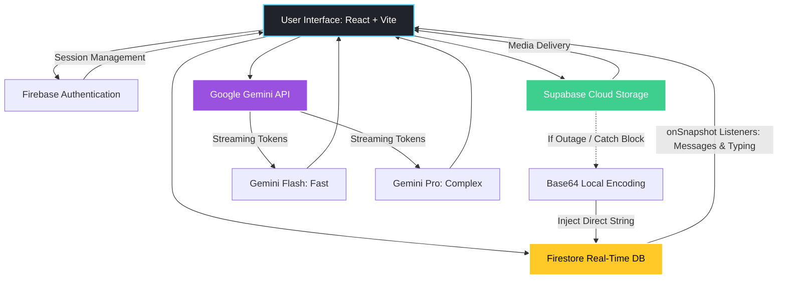

# 💬🤖 OmniChat — Real-Time AI-Integrated Messaging Platform

[](https://reactjs.org/)
[](https://firebase.google.com/)
[](https://supabase.com)
[](https://deepmind.google/technologies/gemini/)

**OmniChat** is a full-stack, real-time web application built to deliver a seamless, WhatsApp-like messaging experience supercharged with cutting-edge AI capabilities. Featuring synchronous database listeners and a resilient offline architecture, OmniChat embeds contextual AI assistance directly within the user workflow.

---

## 📸 UI Screenshots & Demo

### 📱 Live Chat & AI Operations
<table align="center">
  <tr>
    <td align="center" width="50%">
      
      <br><sub><b>1. Real-Time Chat</b></sub>
    </td>
    <td align="center" width="50%">
      
      <br><sub><b>2. Group Administration </b></sub>
    </td>
  </tr>
</table><table align="center">
  <tr>
    <td align="center" width="50%">
      
      <br><sub><b>3. Realtime Game</b></sub>
    </td>
    <td align="center" width="50%">
      
      <br><sub><b>4. Embedded Gemini Chat</b></sub>
    </td>
  </tr>
</table>

---

## ✨ Key Features

### 🔹 Real-Time Messaging & UX
- **Zero-Latency Syncing:** Sub-second message delivery via persistent Firestore data streams.
- **Dynamic Typing States:** Live typing indicators that notify participants immediately as a user inputs text.
- **Delivery Feedback:** Message timestamps paired with accurate delivery statuses.

### 🔹 Embedded Google Gemini AI
- **Native Chat Bot:** Access a powerful conversational assistant directly inside the workspace using `@google/generative-ai`.
- **Dual-Model Scaling:** Toggle between **Gemini Flash** (optimized for lightning-fast responses) and **Gemini Pro** (allocated for deep semantic reasoning and complex queries).

### 🔹 Advanced Group Collaborations
- **Dynamic Room Generation:** Create custom groups and broadcast messages atomically to all group participants.
- **Admin Control Layer:** Permissions to append or remove participants, alongside system-generated activity logs.

### 🔹 Cloud Media Handling & Resilience
- **Rich Media Sharing:** WhatsApp-style image previews with native caption overlays.
- **Graceful Base64 Fallback:** A fail-safe pipeline that intercepts network outages; if Supabase storage is unavailable, images are instantly converted to Base64 strings and stored directly within Firestore to maintain an uninterrupted user experience.

---

## 💡 Technical Highlights & Engineering

- **Reactive UI Patterns:** Leveraged Firestore's `onSnapshot()` engine to establish persistent WebSocket-like connection tunnels, wiping out the need for high-overhead REST polling.
- **Atomic Operations:** Integrated transactional batch writes during group broadcasting sequences to guarantee message consistency across heavy user structures.
- **Performance Debouncing:** Implemented a debounced Firestore update workflow for the `isTyping: true/false` flags, minimizing redundant database writes during active user messaging.

---

## 🏗️ System Architecture



---

## 🛠️ Tech Stack Matrix

| Layer | Technology | Operational Implementation |
| --- | --- | --- |
| **Frontend Framework** | React.js (Vite) | High-performance SPA with modular state management |
| **Routing Architecture** | React Router | Declarative, client-side application navigation |
| **Identity & Security** | Firebase Auth | Secure multi-method authorization and persistent sessions |
| **Real-Time Database** | Cloud Firestore | Reactive schema tracking messages, channels, and typing states |
| **Cloud Object Storage** | Supabase Storage | Distributed cloud bucket architecture hosting high-res chat media |
| **Artificial Intelligence** | Google Gemini API | Asynchronous token streaming pipeline executing Flash & Pro models |
| **UI Presentation** | CSS & React Toastify | Customized modular layouts paired with dynamic action alerts |

---

## 📁 Project Structure

```
OmniChat/
├── src/
│   ├── components/   # Modular UI elements (ChatBubble, InputArea, Sidebar)
│   ├── config/       # Core initializations (Firebase, Supabase, Gemini SDK)
│   ├── hooks/        # Reusable state logic and debounced field update utilities
│   ├── pages/        # Main views (Authentication Portal, Live Chat Workspace)
│   ├── App.jsx       # Global application root and client routing rules
│   └── main.jsx      # DOM mount point incorporating systemic context providers
├── public/           # Static asset configurations and brand icons
└── package.json      # Dependencies and execution script trees

```

---

## ⚙️ Local Development Setup

### 1. Repository Preparation

Navigate into the workspace and fetch core dependencies:

```bash
cd OmniChat
npm install

```

### 2. Environment Configuration

Create a `.env` file in the root directory and inject your cloud service credentials:

```env
VITE_FIREBASE_API_KEY=your_firebase_key
VITE_FIREBASE_AUTH_DOMAIN=your_auth_domain
VITE_FIREBASE_PROJECT_ID=your_project_id
VITE_FIREBASE_STORAGE_BUCKET=your_storage_bucket
VITE_FIREBASE_MESSAGING_SENDER_ID=your_sender_id
VITE_FIREBASE_APP_ID=your_app_id

VITE_SUPABASE_URL=your_supabase_url_endpoint
VITE_SUPABASE_ANON_KEY=your_supabase_anon_public_key

VITE_GEMINI_API_KEY=your_google_gemini_api_key

```

### 3. Launching the App

Spin up the local development hot-reload server:

```bash
npm run dev


